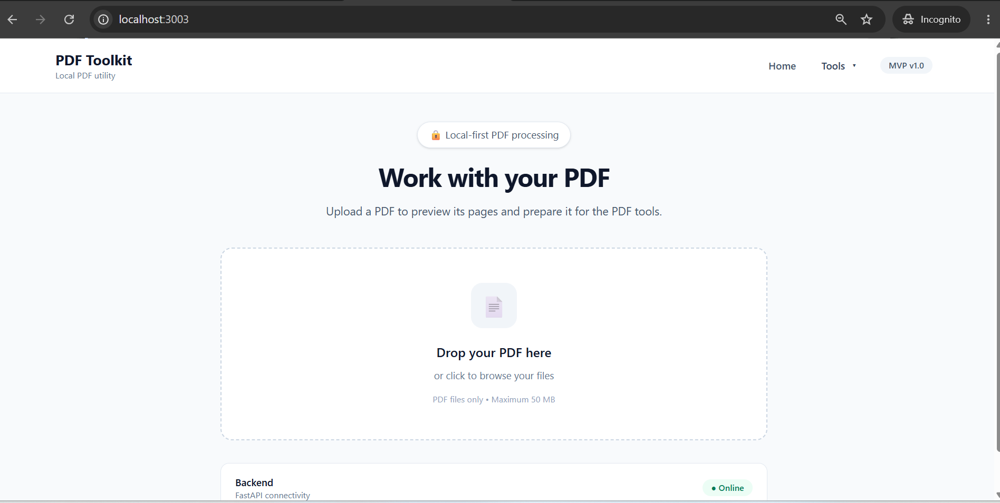
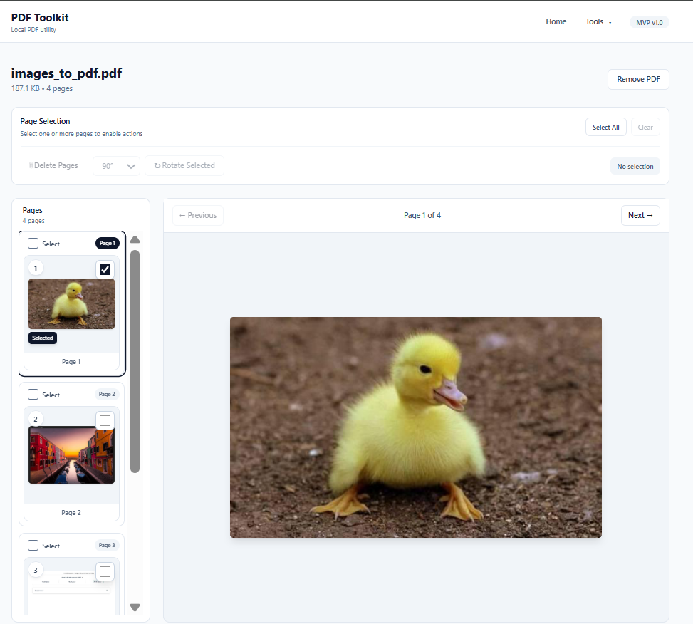
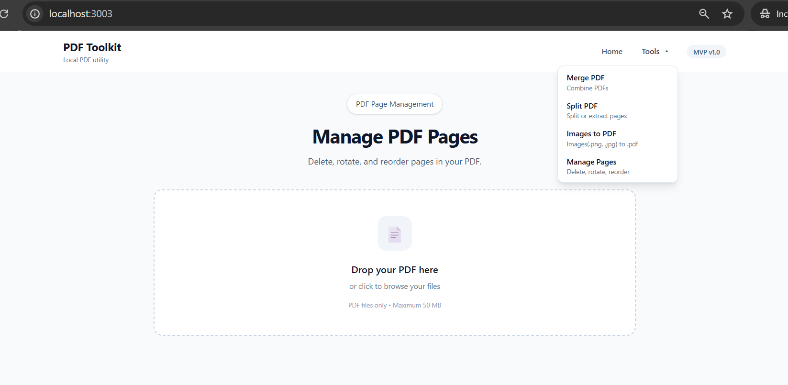

# PDF Toolkit

 A local-first, browser-based PDF utility application built with **React + TypeScript** and **FastAPI + Python**.

 PDF Toolkit provides a web-based interface for working with PDF files while keeping the application and document processing on your local machine.

 > **Local-first by design:** your PDF files are intended to be processed through your locally running application rather than being uploaded to a third-party PDF service.

---

 ## ✨ Features

 - 🖥️ Browser-based user interface
- ⚛️ React + TypeScript frontend
- 🐍 FastAPI + Python backend
- 📄 PDF processing through a local application
- 🔒 Local-first document workflow
- 🧩 Separate frontend and backend architecture
- 🛠️ Suitable for local development and self-hosted use

---

 ## 🏗️ Architecture

 PDF Toolkit is organized around two primary components:

```
┌─────────────────────────────┐
│        Web Browser          │
│                             │
│   React + TypeScript UI     │
└──────────────┬──────────────┘
               │
               │ HTTP/API
               ▼
┌─────────────────────────────┐
│       FastAPI Backend       │
│                             │
│      Python PDF Logic       │
└──────────────┬──────────────┘
               │
               ▼
┌─────────────────────────────┐
│       Local File System     │
│                             │
│       PDF Documents         │
└─────────────────────────────┘
```

 The frontend provides the user interface, while the FastAPI backend handles backend-side application and PDF-processing functionality.

---

 ## 🧰 Tech Stack

 ### Frontend

 - **React**
- **TypeScript**
- Browser-based UI

 ### Backend

 - **Python**
- **FastAPI**

 ### Application Model

 - Local-first
- Client/browser-based interface
- Locally running backend
- Local document processing and storage

---

 ## 🚀 Getting Started

 ### Prerequisites

 Make sure the following are available on your development machine:

 - Git
- Node.js and npm
- Python 3
- A modern web browser

 ### 1\. Clone the repository

```
git clone https://github.com/Tarak-Chandra-Sarkar/pdf-toolkit.git
cd pdf-toolkit
```

 ### 2\. Install frontend dependencies

 Navigate to the frontend directory used by the project and install its dependencies:

```
cd frontend
npm install
```

 ### 3\. Install backend dependencies

 Navigate to the backend directory and install the Python dependencies specified by the project:

```
cd backend
pip install -r requirements.txt
```

 If the repository uses a Python virtual environment, create one first:

```
python -m venv .venv
```

 Activate it on macOS/Linux:

```
source .venv/bin/activate
```

 On Windows:

```
.venv\Scripts\Activate.ps1
```

 Then install the backend dependencies:

```
pip install -r requirements.txt
```

 ### 4\. Start the backend

 Run the FastAPI application using the project's configured application entry point.

 For example:

```
cp env.example .env
uvicorn app.main:app --reload --port 8008
```

 ### 5\. Start the frontend

 Run the React development server:

```
cp env.example .env
npm run dev
```

 Then open the development URL displayed by the frontend tooling in your browser.


---

 ## 📁 Project Structure

 The application follows a frontend/backend architecture similar to:

```
pdf-toolkit/
├── frontend/              # React + TypeScript application
│   ├── src/
│   ├── public/
│   └── package.json
│
├── backend/               # FastAPI + Python application
│   ├── ...
│   ├── requirements.txt
│   └── ...
│
├── README.md
└── LICENSE
```

 The exact directory layout may evolve as additional PDF functionality is added.

---

 ## 🔐 Local-First & Privacy

 PDF documents can contain sensitive information such as:

 - Personal documents
- Financial records
- Business documents
- Contracts
- Invoices
- Identification documents

 PDF Toolkit is designed around a **local-first workflow**, where the application and its backend run on the user's own machine.

 This makes it suitable for workflows where sending documents to an external online PDF-processing service is undesirable.


---

 ---

 # Feature Status

| Feature                | Status |
| ---------------------- | ------ |
| Home page              | ✅      |
| Backend health         | ✅      |
| PDF upload             | ✅      |
| PDF inspection         | ✅      |
| PDF metadata           | ✅      |
| PDF page count         | ✅      |
| PDF preview            | ✅      |
| Page thumbnails        | ✅      |
| PDF download           | ✅      |
| PDF delete             | ✅      |
| Merge PDF              | ✅      |
| Split PDF              | ✅      |
| Extract page range     | ✅      |
| Images → PDF           | ✅      |
| Local storage          | ✅      |
| Swagger UI             | ✅      |
| ReDoc                  | ✅      |
| React UI               | ✅      |
| Drag & drop PDF upload | ✅      |
| Docker                 | ⏳      |
| OCR                    | ⏳      |
| PDF → Word             | ⏳      |
| PDF compression        | ⏳      |
| PDF encryption         | ⏳      |
| Watermark              | ⏳      |


---
## Screenshots


---

## Author

👤 **Tarak Chandra Sarkar**

* Github: [@tarak-chandra-sarkar](https://github.com/Tarak-Chandra-Sarkar)
* LinkedIn: [@tarak-chandra-sarkar](https://www.linkedin.com/in/tarak-chandra-sarkar/)

## 🤝 Contributing

N/A
---

 ## 📄 License

Copyright &copy; 2026 [Tarak Chandra Sarkar](https://github.com/Tarak-Chandra-Sarkar/pdf-toolkit).

This project is [MIT](/LICENSE) licensed.

---

 ## ⭐ Support the Project

 If PDF Toolkit is useful to you, consider giving the repository a ⭐ on GitHub and contributing improvements, documentation, or bug fixes.